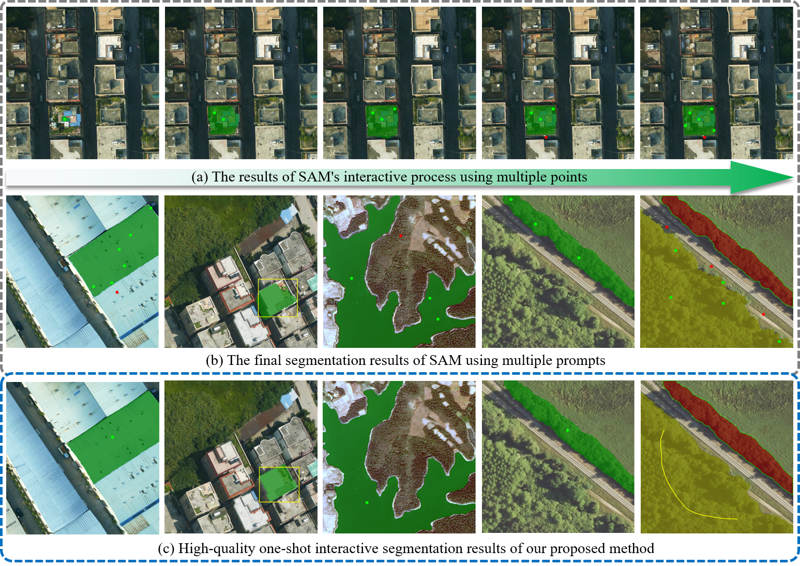
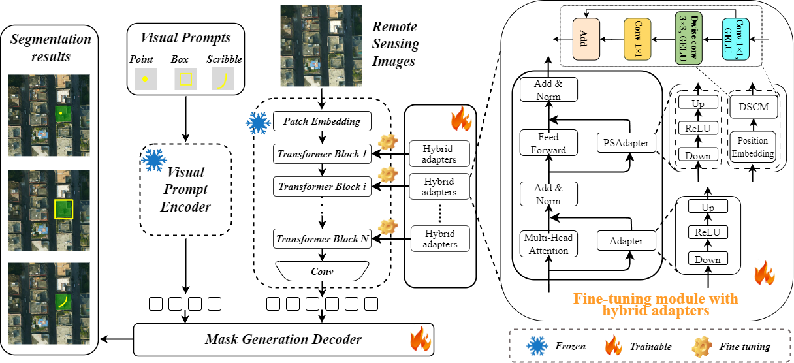

# OSISeg

## Title of paper to be published

High-Quality One-Shot Interactive Segmentation for Remote Sensing Images via Hybrid Adapter-Enhanced Foundation Models
   

## The challenge of current interactive segmentation methods for remote sensing images  
Existing interactive segmentation methods, such as SAM, are primarily designed for natural images and show inefficiencies when 
applied to remote sensing images. These methods often require multiple interactions to achieve satisfactory labeling results 
and frequently struggle to obtain precise target boundaries. 

     
    Figure1. High-quality segmentation results of SAM and the proposed one-shot interactive segmentation method on remote sensing images. Green dots indicate positive sample points, red dots indicate negative sample points, yellow boxes represent bounding boxes, and yellow lines denote scribbles.

## Brief description of the proposed method
To address these limitations above, we propose a high-quality one-shot interactive
segmentation method (OSISeg) based on the fine-tuning of foundation models, tailored for the efficient annotation of typical 
objects in remote sensing imagery. OSISeg utilizes robust visual priors from foundation models and implements a hybrid 
adapter-based strategy for fine-tuning these models. Specifically, It employs a parallel structure with hybrid adapter designs
to adjust multi-head self-attention and feed-forward neural networks within foundation models, effectively aligning remote sensing 
image features for interactive segmentation tasks. Furthermore, the proposed OSISeg integrates point, box, and scribble prompts, 
facilitating high-quality segmentation only using one prompt through a lightweight decoder.

     
    Figure2. OSISeg: A high-quality one-shot interactive segmentation method for remote sensing images via hybrid adapter-enhanced foundation models. 

